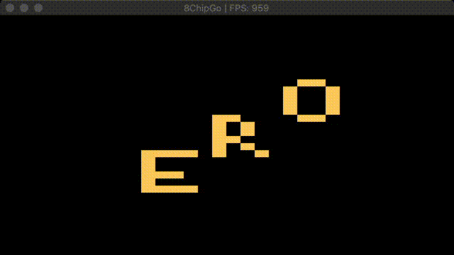

# 8Chipgo
[](https://goreportcard.com/report/github.com/vatsalp/8chipgo)

Chip8  emulator made in Go using [pixel](https://github.com/faiface/pixel) library



```
go get github.com/VatsalP/8chipgo
```

You can try some roms from [here](https://github.com/dmatlack/chip8/tree/master/roms)

```
$(go env GOPATH)/8chip -rom romfile
```

Keyboard mapping in form of - Currently used (corresponding in original)

|   |   |   |   |
|:-:|---|---|---|
|1(1)|2(2)|3(3)|4(C)|
|q(4)|w(5)|e(6)|r(D)|
|a(7)|s(8)|d(9)|f(E)|
|z(A)|x(0)|c(b)|v(F)|

There are additional requirements for building pixel (see more in pixel [repo](https://github.com/faiface/pixel)):

- On macOS, you need Xcode or Command Line Tools for Xcode (xcode-select --install) for required headers and libraries.
- On Ubuntu/Debian-like Linux distributions, you need libgl1-mesa-dev and xorg-dev packages.
- On CentOS/Fedora-like Linux distributions, you need libX11-devel libXcursor-devel libXrandr-devel libXinerama-devel mesa-libGL-devel libXi-devel packages.

Also might need libasound2-dev on Ubuntu or equivalent on others for [beep](https://github.com/faiface/beep)
